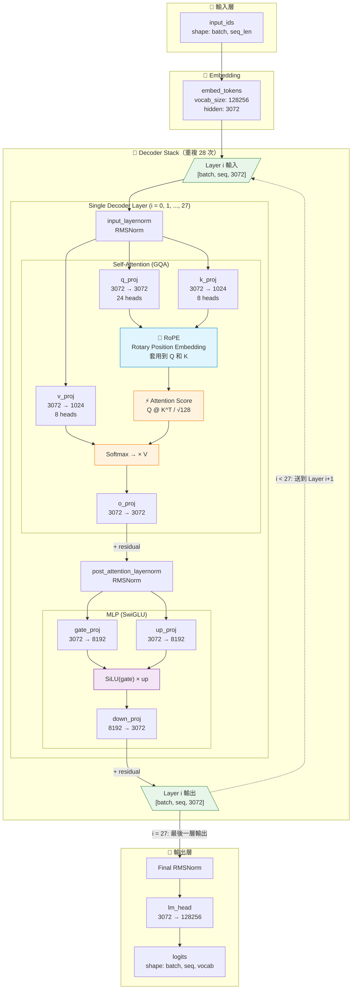

# Llama 3.2 3B 模型架構分析

## 模型基本資訊

| 參數 | 值 |
|------|-----|
| model_type | llama |
| hidden_size | 3072 |
| num_hidden_layers | 28 |
| num_attention_heads | 24 |
| num_key_value_heads | 8 (GQA) |
| head_dim | 128 |
| intermediate_size | 8192 |
| vocab_size | 128256 |
| max_position_embeddings | 131072 |
| rope_theta | 500000.0 |

## 架構圖

> **注意**：下圖中的 "Single Decoder Layer" 會**重複 28 次**（Layer 0 ~ Layer 27），每層的輸出作為下一層的輸入。



### 資料流說明

```
輸入 → Embedding → [Layer 0] → [Layer 1] → ... → [Layer 27] → Final Norm → lm_head → 輸出
                      ↑                              ↓
                      └──────── 重複 28 次 ──────────┘
```

## 關鍵組件說明

### 1. RoPE (Rotary Position Embedding)
- 位置：在 Q, K 計算後、Attention Score 計算前
- 作用：將位置資訊編碼到 query 和 key 中
- 參數：`rope_theta = 500000.0`

### 2. GQA (Grouped Query Attention)
- 設計：24 個 query heads 共享 8 個 key/value heads
- 比例：每 3 個 Q heads 共享 1 個 KV head
- 優點：減少 KV cache 記憶體使用

### 3. Attention Score 計算
```
Attention(Q, K, V) = softmax(Q @ K^T / sqrt(head_dim)) @ V
```
- head_dim = 128

### 4. SwiGLU MLP
```
MLP(x) = down_proj(SiLU(gate_proj(x)) * up_proj(x))
```
- intermediate_size = 8192

## 詳細層級結構

```
================================================================================================================================================================
Layer (type (var_name))                                      Input Shape               Output Shape              Param #                   Mult-Adds
================================================================================================================================================================
LlamaForCausalLM (LlamaForCausalLM)                          [1, 4]                    --                        --                        --
├─LlamaModel (model)                                         --                        --                        --                        --
│    └─Embedding (embed_tokens)                              [1, 4]                    [1, 4, 3072]              394,002,432               394,002,432
│    └─LlamaRotaryEmbedding (rotary_emb)                     [1, 4, 3072]              [1, 4, 128]               --                        --
│    └─ModuleList (layers)                                   --                        --                        --                        --
│    │    └─LlamaDecoderLayer (0)                            [1, 4, 3072]              [1, 4, 3072]              --                        --
│    │    │    └─LlamaRMSNorm (input_layernorm)              [1, 4, 3072]              [1, 4, 3072]              3,072                     3,072
│    │    │    └─LlamaAttention (self_attn)                  --                        [1, 4, 3072]              25,165,824                25,165,824
│    │    │    └─LlamaRMSNorm (post_attention_layernorm)     [1, 4, 3072]              [1, 4, 3072]              3,072                     3,072
│    │    │    └─LlamaMLP (mlp)                              [1, 4, 3072]              [1, 4, 3072]              75,497,472                75,497,472
│    │    └─LlamaDecoderLayer (1)                            [1, 4, 3072]              [1, 4, 3072]              --                        --
│    │    │    └─LlamaRMSNorm (input_layernorm)              [1, 4, 3072]              [1, 4, 3072]              3,072                     3,072
│    │    │    └─LlamaAttention (self_attn)                  --                        [1, 4, 3072]              25,165,824                25,165,824
│    │    │    └─LlamaRMSNorm (post_attention_layernorm)     [1, 4, 3072]              [1, 4, 3072]              3,072                     3,072
│    │    │    └─LlamaMLP (mlp)                              [1, 4, 3072]              [1, 4, 3072]              75,497,472                75,497,472
│    │    └─LlamaDecoderLayer (2)                            [1, 4, 3072]              [1, 4, 3072]              --                        --
│    │    │    └─LlamaRMSNorm (input_layernorm)              [1, 4, 3072]              [1, 4, 3072]              3,072                     3,072
│    │    │    └─LlamaAttention (self_attn)                  --                        [1, 4, 3072]              25,165,824                25,165,824
│    │    │    └─LlamaRMSNorm (post_attention_layernorm)     [1, 4, 3072]              [1, 4, 3072]              3,072                     3,072
│    │    │    └─LlamaMLP (mlp)                              [1, 4, 3072]              [1, 4, 3072]              75,497,472                75,497,472
│    │    └─LlamaDecoderLayer (3)                            [1, 4, 3072]              [1, 4, 3072]              --                        --
│    │    │    └─LlamaRMSNorm (input_layernorm)              [1, 4, 3072]              [1, 4, 3072]              3,072                     3,072
│    │    │    └─LlamaAttention (self_attn)                  --                        [1, 4, 3072]              25,165,824                25,165,824
│    │    │    └─LlamaRMSNorm (post_attention_layernorm)     [1, 4, 3072]              [1, 4, 3072]              3,072                     3,072
│    │    │    └─LlamaMLP (mlp)                              [1, 4, 3072]              [1, 4, 3072]              75,497,472                75,497,472
│    │    └─LlamaDecoderLayer (4)                            [1, 4, 3072]              [1, 4, 3072]              --                        --
│    │    │    └─LlamaRMSNorm (input_layernorm)              [1, 4, 3072]              [1, 4, 3072]              3,072                     3,072
│    │    │    └─LlamaAttention (self_attn)                  --                        [1, 4, 3072]              25,165,824                25,165,824
│    │    │    └─LlamaRMSNorm (post_attention_layernorm)     [1, 4, 3072]              [1, 4, 3072]              3,072                     3,072
│    │    │    └─LlamaMLP (mlp)                              [1, 4, 3072]              [1, 4, 3072]              75,497,472                75,497,472
│    │    └─LlamaDecoderLayer (5)                            [1, 4, 3072]              [1, 4, 3072]              --                        --
│    │    │    └─LlamaRMSNorm (input_layernorm)              [1, 4, 3072]              [1, 4, 3072]              3,072                     3,072
│    │    │    └─LlamaAttention (self_attn)                  --                        [1, 4, 3072]              25,165,824                25,165,824
│    │    │    └─LlamaRMSNorm (post_attention_layernorm)     [1, 4, 3072]              [1, 4, 3072]              3,072                     3,072
│    │    │    └─LlamaMLP (mlp)                              [1, 4, 3072]              [1, 4, 3072]              75,497,472                75,497,472
│    │    └─LlamaDecoderLayer (6)                            [1, 4, 3072]              [1, 4, 3072]              --                        --
│    │    │    └─LlamaRMSNorm (input_layernorm)              [1, 4, 3072]              [1, 4, 3072]              3,072                     3,072
│    │    │    └─LlamaAttention (self_attn)                  --                        [1, 4, 3072]              25,165,824                25,165,824
│    │    │    └─LlamaRMSNorm (post_attention_layernorm)     [1, 4, 3072]              [1, 4, 3072]              3,072                     3,072
│    │    │    └─LlamaMLP (mlp)                              [1, 4, 3072]              [1, 4, 3072]              75,497,472                75,497,472
│    │    └─LlamaDecoderLayer (7)                            [1, 4, 3072]              [1, 4, 3072]              --                        --
│    │    │    └─LlamaRMSNorm (input_layernorm)              [1, 4, 3072]              [1, 4, 3072]              3,072                     3,072
│    │    │    └─LlamaAttention (self_attn)                  --                        [1, 4, 3072]              25,165,824                25,165,824
│    │    │    └─LlamaRMSNorm (post_attention_layernorm)     [1, 4, 3072]              [1, 4, 3072]              3,072                     3,072
│    │    │    └─LlamaMLP (mlp)                              [1, 4, 3072]              [1, 4, 3072]              75,497,472                75,497,472
│    │    └─LlamaDecoderLayer (8)                            [1, 4, 3072]              [1, 4, 3072]              --                        --
│    │    │    └─LlamaRMSNorm (input_layernorm)              [1, 4, 3072]              [1, 4, 3072]              3,072                     3,072
│    │    │    └─LlamaAttention (self_attn)                  --                        [1, 4, 3072]              25,165,824                25,165,824
│    │    │    └─LlamaRMSNorm (post_attention_layernorm)     [1, 4, 3072]              [1, 4, 3072]              3,072                     3,072
│    │    │    └─LlamaMLP (mlp)                              [1, 4, 3072]              [1, 4, 3072]              75,497,472                75,497,472
│    │    └─LlamaDecoderLayer (9)                            [1, 4, 3072]              [1, 4, 3072]              --                        --
│    │    │    └─LlamaRMSNorm (input_layernorm)              [1, 4, 3072]              [1, 4, 3072]              3,072                     3,072
│    │    │    └─LlamaAttention (self_attn)                  --                        [1, 4, 3072]              25,165,824                25,165,824
│    │    │    └─LlamaRMSNorm (post_attention_layernorm)     [1, 4, 3072]              [1, 4, 3072]              3,072                     3,072
│    │    │    └─LlamaMLP (mlp)                              [1, 4, 3072]              [1, 4, 3072]              75,497,472                75,497,472
│    │    └─LlamaDecoderLayer (10)                           [1, 4, 3072]              [1, 4, 3072]              --                        --
│    │    │    └─LlamaRMSNorm (input_layernorm)              [1, 4, 3072]              [1, 4, 3072]              3,072                     3,072
│    │    │    └─LlamaAttention (self_attn)                  --                        [1, 4, 3072]              25,165,824                25,165,824
│    │    │    └─LlamaRMSNorm (post_attention_layernorm)     [1, 4, 3072]              [1, 4, 3072]              3,072                     3,072
│    │    │    └─LlamaMLP (mlp)                              [1, 4, 3072]              [1, 4, 3072]              75,497,472                75,497,472
│    │    └─LlamaDecoderLayer (11)                           [1, 4, 3072]              [1, 4, 3072]              --                        --
│    │    │    └─LlamaRMSNorm (input_layernorm)              [1, 4, 3072]              [1, 4, 3072]              3,072                     3,072
│    │    │    └─LlamaAttention (self_attn)                  --                        [1, 4, 3072]              25,165,824                25,165,824
│    │    │    └─LlamaRMSNorm (post_attention_layernorm)     [1, 4, 3072]              [1, 4, 3072]              3,072                     3,072
│    │    │    └─LlamaMLP (mlp)                              [1, 4, 3072]              [1, 4, 3072]              75,497,472                75,497,472
│    │    └─LlamaDecoderLayer (12)                           [1, 4, 3072]              [1, 4, 3072]              --                        --
│    │    │    └─LlamaRMSNorm (input_layernorm)              [1, 4, 3072]              [1, 4, 3072]              3,072                     3,072
│    │    │    └─LlamaAttention (self_attn)                  --                        [1, 4, 3072]              25,165,824                25,165,824
│    │    │    └─LlamaRMSNorm (post_attention_layernorm)     [1, 4, 3072]              [1, 4, 3072]              3,072                     3,072
│    │    │    └─LlamaMLP (mlp)                              [1, 4, 3072]              [1, 4, 3072]              75,497,472                75,497,472
│    │    └─LlamaDecoderLayer (13)                           [1, 4, 3072]              [1, 4, 3072]              --                        --
│    │    │    └─LlamaRMSNorm (input_layernorm)              [1, 4, 3072]              [1, 4, 3072]              3,072                     3,072
│    │    │    └─LlamaAttention (self_attn)                  --                        [1, 4, 3072]              25,165,824                25,165,824
│    │    │    └─LlamaRMSNorm (post_attention_layernorm)     [1, 4, 3072]              [1, 4, 3072]              3,072                     3,072
│    │    │    └─LlamaMLP (mlp)                              [1, 4, 3072]              [1, 4, 3072]              75,497,472                75,497,472
│    │    └─LlamaDecoderLayer (14)                           [1, 4, 3072]              [1, 4, 3072]              --                        --
│    │    │    └─LlamaRMSNorm (input_layernorm)              [1, 4, 3072]              [1, 4, 3072]              3,072                     3,072
│    │    │    └─LlamaAttention (self_attn)                  --                        [1, 4, 3072]              25,165,824                25,165,824
│    │    │    └─LlamaRMSNorm (post_attention_layernorm)     [1, 4, 3072]              [1, 4, 3072]              3,072                     3,072
│    │    │    └─LlamaMLP (mlp)                              [1, 4, 3072]              [1, 4, 3072]              75,497,472                75,497,472
│    │    └─LlamaDecoderLayer (15)                           [1, 4, 3072]              [1, 4, 3072]              --                        --
│    │    │    └─LlamaRMSNorm (input_layernorm)              [1, 4, 3072]              [1, 4, 3072]              3,072                     3,072
│    │    │    └─LlamaAttention (self_attn)                  --                        [1, 4, 3072]              25,165,824                25,165,824
│    │    │    └─LlamaRMSNorm (post_attention_layernorm)     [1, 4, 3072]              [1, 4, 3072]              3,072                     3,072
│    │    │    └─LlamaMLP (mlp)                              [1, 4, 3072]              [1, 4, 3072]              75,497,472                75,497,472
│    │    └─LlamaDecoderLayer (16)                           [1, 4, 3072]              [1, 4, 3072]              --                        --
│    │    │    └─LlamaRMSNorm (input_layernorm)              [1, 4, 3072]              [1, 4, 3072]              3,072                     3,072
│    │    │    └─LlamaAttention (self_attn)                  --                        [1, 4, 3072]              25,165,824                25,165,824
│    │    │    └─LlamaRMSNorm (post_attention_layernorm)     [1, 4, 3072]              [1, 4, 3072]              3,072                     3,072
│    │    │    └─LlamaMLP (mlp)                              [1, 4, 3072]              [1, 4, 3072]              75,497,472                75,497,472
│    │    └─LlamaDecoderLayer (17)                           [1, 4, 3072]              [1, 4, 3072]              --                        --
│    │    │    └─LlamaRMSNorm (input_layernorm)              [1, 4, 3072]              [1, 4, 3072]              3,072                     3,072
│    │    │    └─LlamaAttention (self_attn)                  --                        [1, 4, 3072]              25,165,824                25,165,824
│    │    │    └─LlamaRMSNorm (post_attention_layernorm)     [1, 4, 3072]              [1, 4, 3072]              3,072                     3,072
│    │    │    └─LlamaMLP (mlp)                              [1, 4, 3072]              [1, 4, 3072]              75,497,472                75,497,472
│    │    └─LlamaDecoderLayer (18)                           [1, 4, 3072]              [1, 4, 3072]              --                        --
│    │    │    └─LlamaRMSNorm (input_layernorm)              [1, 4, 3072]              [1, 4, 3072]              3,072                     3,072
│    │    │    └─LlamaAttention (self_attn)                  --                        [1, 4, 3072]              25,165,824                25,165,824
│    │    │    └─LlamaRMSNorm (post_attention_layernorm)     [1, 4, 3072]              [1, 4, 3072]              3,072                     3,072
│    │    │    └─LlamaMLP (mlp)                              [1, 4, 3072]              [1, 4, 3072]              75,497,472                75,497,472
│    │    └─LlamaDecoderLayer (19)                           [1, 4, 3072]              [1, 4, 3072]              --                        --
│    │    │    └─LlamaRMSNorm (input_layernorm)              [1, 4, 3072]              [1, 4, 3072]              3,072                     3,072
│    │    │    └─LlamaAttention (self_attn)                  --                        [1, 4, 3072]              25,165,824                25,165,824
│    │    │    └─LlamaRMSNorm (post_attention_layernorm)     [1, 4, 3072]              [1, 4, 3072]              3,072                     3,072
│    │    │    └─LlamaMLP (mlp)                              [1, 4, 3072]              [1, 4, 3072]              75,497,472                75,497,472
│    │    └─LlamaDecoderLayer (20)                           [1, 4, 3072]              [1, 4, 3072]              --                        --
│    │    │    └─LlamaRMSNorm (input_layernorm)              [1, 4, 3072]              [1, 4, 3072]              3,072                     3,072
│    │    │    └─LlamaAttention (self_attn)                  --                        [1, 4, 3072]              25,165,824                25,165,824
│    │    │    └─LlamaRMSNorm (post_attention_layernorm)     [1, 4, 3072]              [1, 4, 3072]              3,072                     3,072
│    │    │    └─LlamaMLP (mlp)                              [1, 4, 3072]              [1, 4, 3072]              75,497,472                75,497,472
│    │    └─LlamaDecoderLayer (21)                           [1, 4, 3072]              [1, 4, 3072]              --                        --
│    │    │    └─LlamaRMSNorm (input_layernorm)              [1, 4, 3072]              [1, 4, 3072]              3,072                     3,072
│    │    │    └─LlamaAttention (self_attn)                  --                        [1, 4, 3072]              25,165,824                25,165,824
│    │    │    └─LlamaRMSNorm (post_attention_layernorm)     [1, 4, 3072]              [1, 4, 3072]              3,072                     3,072
│    │    │    └─LlamaMLP (mlp)                              [1, 4, 3072]              [1, 4, 3072]              75,497,472                75,497,472
│    │    └─LlamaDecoderLayer (22)                           [1, 4, 3072]              [1, 4, 3072]              --                        --
│    │    │    └─LlamaRMSNorm (input_layernorm)              [1, 4, 3072]              [1, 4, 3072]              3,072                     3,072
│    │    │    └─LlamaAttention (self_attn)                  --                        [1, 4, 3072]              25,165,824                25,165,824
│    │    │    └─LlamaRMSNorm (post_attention_layernorm)     [1, 4, 3072]              [1, 4, 3072]              3,072                     3,072
│    │    │    └─LlamaMLP (mlp)                              [1, 4, 3072]              [1, 4, 3072]              75,497,472                75,497,472
│    │    └─LlamaDecoderLayer (23)                           [1, 4, 3072]              [1, 4, 3072]              --                        --
│    │    │    └─LlamaRMSNorm (input_layernorm)              [1, 4, 3072]              [1, 4, 3072]              3,072                     3,072
│    │    │    └─LlamaAttention (self_attn)                  --                        [1, 4, 3072]              25,165,824                25,165,824
│    │    │    └─LlamaRMSNorm (post_attention_layernorm)     [1, 4, 3072]              [1, 4, 3072]              3,072                     3,072
│    │    │    └─LlamaMLP (mlp)                              [1, 4, 3072]              [1, 4, 3072]              75,497,472                75,497,472
│    │    └─LlamaDecoderLayer (24)                           [1, 4, 3072]              [1, 4, 3072]              --                        --
│    │    │    └─LlamaRMSNorm (input_layernorm)              [1, 4, 3072]              [1, 4, 3072]              3,072                     3,072
│    │    │    └─LlamaAttention (self_attn)                  --                        [1, 4, 3072]              25,165,824                25,165,824
│    │    │    └─LlamaRMSNorm (post_attention_layernorm)     [1, 4, 3072]              [1, 4, 3072]              3,072                     3,072
│    │    │    └─LlamaMLP (mlp)                              [1, 4, 3072]              [1, 4, 3072]              75,497,472                75,497,472
│    │    └─LlamaDecoderLayer (25)                           [1, 4, 3072]              [1, 4, 3072]              --                        --
│    │    │    └─LlamaRMSNorm (input_layernorm)              [1, 4, 3072]              [1, 4, 3072]              3,072                     3,072
│    │    │    └─LlamaAttention (self_attn)                  --                        [1, 4, 3072]              25,165,824                25,165,824
│    │    │    └─LlamaRMSNorm (post_attention_layernorm)     [1, 4, 3072]              [1, 4, 3072]              3,072                     3,072
│    │    │    └─LlamaMLP (mlp)                              [1, 4, 3072]              [1, 4, 3072]              75,497,472                75,497,472
│    │    └─LlamaDecoderLayer (26)                           [1, 4, 3072]              [1, 4, 3072]              --                        --
│    │    │    └─LlamaRMSNorm (input_layernorm)              [1, 4, 3072]              [1, 4, 3072]              3,072                     3,072
│    │    │    └─LlamaAttention (self_attn)                  --                        [1, 4, 3072]              25,165,824                25,165,824
│    │    │    └─LlamaRMSNorm (post_attention_layernorm)     [1, 4, 3072]              [1, 4, 3072]              3,072                     3,072
│    │    │    └─LlamaMLP (mlp)                              [1, 4, 3072]              [1, 4, 3072]              75,497,472                75,497,472
│    │    └─LlamaDecoderLayer (27)                           [1, 4, 3072]              [1, 4, 3072]              --                        --
│    │    │    └─LlamaRMSNorm (input_layernorm)              [1, 4, 3072]              [1, 4, 3072]              3,072                     3,072
│    │    │    └─LlamaAttention (self_attn)                  --                        [1, 4, 3072]              25,165,824                25,165,824
│    │    │    └─LlamaRMSNorm (post_attention_layernorm)     [1, 4, 3072]              [1, 4, 3072]              3,072                     3,072
│    │    │    └─LlamaMLP (mlp)                              [1, 4, 3072]              [1, 4, 3072]              75,497,472                75,497,472
│    └─LlamaRMSNorm (norm)                                   [1, 4, 3072]              [1, 4, 3072]              3,072                     3,072
├─Linear (lm_head)                                           [1, 4, 3072]              [1, 4, 128256]            394,002,432               394,002,432
================================================================================================================================================================
Total params: 3,606,752,256
Trainable params: 3,606,752,256
Non-trainable params: 0
Total mult-adds (Units.GIGABYTES): 3.61
================================================================================================================================================================
Input size (MB): 0.00
Forward/backward pass size (MB): 17.29
Params size (MB): 7213.50
Estimated Total Size (MB): 7230.79
================================================================================================================================================================
```
