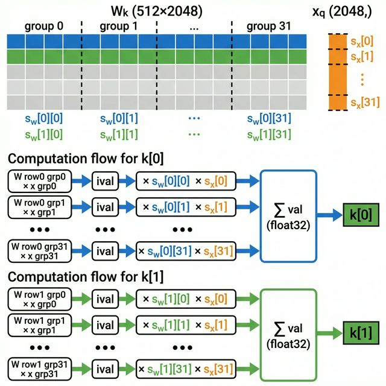

# runq.c Forward Pass 分析報告

> **對象：** Llama 3.2 1B Int8 量化推論程式
> **範圍：** `forward()` 函式（L390-532）— 單一 token 的前向傳播

---

## 1. 運算類型彙整

`forward()` 中包含以下運算，可依精度與類型分為三大類：

| 步驟 | 運算 | 類型 | 精度 | 維度 | 說明 |
|---|---|---|---|---|---|
| 1 | RMSNorm | 逐元素 | float32 | (2048,) | 1/√(Σx²/n)×weight |
| 2 | QKV matmul (Wq,Wk,Wv) | 矩陣×向量 | int8 | W(2048,2048)×x(2048,)→(2048,) | |
| 3 | RoPE | 逐 pair (2D 旋轉) | float32 | 每次 2 個元素 | (x',y')=(x·cosθ−y·sinθ, x·sinθ+y·cosθ), θ=pos/500000^(d/64) |
| 4 | Attention Q·K | 點積 | float32 | (64,)·(64,)→純量 | 每 head 獨立 |
| 5 | Softmax | 逐元素 | float32 | (pos+1,) | softmax(xᵢ) = e^xᵢ / Σe^xⱼ |
| 6 | Attention scores×V | 純量×向量加總 | float32 | Σ(純量×(64,))→(64,) | 加權求和 |
| 7 | Output matmul (Wo) | 矩陣×向量 | int8 | W(2048,2048)×x(2048,)→(2048,) | |
| 8 | 殘差 | 逐元素加法 | float32 | (2048,) | x += xb |
| 9 | FFN matmul (W1,W3) | 矩陣×向量 | int8 | W(8192,2048)×x(2048,)→(8192,) | 佔 ~70% |
| 10 | FFN matmul (W2) | 矩陣×向量 | int8 | W(2048,8192)×x(8192,)→(2048,) | |
| 11 | 殘差 | 逐元素加法 | float32 | (2048,) | x += xb |

**核心觀察：**
- **矩陣×向量乘法（int8）** 佔 90%+ 運算量，適合硬體加速（systolic array）
- **非線性函數**（softmax, RoPE, RMSNorm）必須用 float32，因為 int8 沒有 exp、cos、sqrt 等運算

---

## 2. Int8 量化策略

### 為什麼用量化？

矩陣×向量乘法佔大部分運算量。用 int8 取代 float32 可以：
- 運算速度提升（int8 乘法比 float32 快且硬體面積小）
- 記憶體用量減少（1 byte vs 4 bytes per weight）

### 哪些運算可以量化？

**只有 matmul 可以用 int8**，因為 matmul 只需要乘法和加法。
其他運算（softmax 的 exp、RoPE 的 cos/sin、RMSNorm 的 sqrt）在整數世界裡不存在。

### quantize 的做法

每 GS=64 個 float 為一組，找出最大絕對值作為 scale factor：

```c
scale = max_abs / 127;
quantized_value = round(float_value / scale);   // float32 → int8
```

matmul 中，int8 × int8 累加到 int32，每組做完後乘回 scale 還原 float32：

```c
val += (float)ival * w_scale * x_scale;
```



### 一層 Transformer 的資料流

```
步驟                    精度          quantize？
───────────────────────────────────────────────
1. RMSNorm(x → xb)     float32       ❌
   ── quantize(xb → xq) ──           ✅
2. matmul(xq × Wq → q) int8×int8     ← QKV 投影
3. matmul(xq × Wk → k) int8×int8
4. matmul(xq × Wv → v) int8×int8
5. RoPE(q, k)           float32       ❌
6. 存 K,V 到 cache      float32       ❌
7. Q·K 點積 + softmax   float32       ❌
8. scores × V           float32       ❌
   ── quantize(attn → xq) ──         ✅
9. matmul(xq × Wo)      int8×int8
10. 殘差 x += xb         float32       ❌
11. RMSNorm → FFN        float32       ❌
   ── quantize ──                     ✅
12-14. FFN matmul (W1,W3,W2)  int8×int8
15. 殘差 x += xb         float32       ❌
```

每層：**4 次 quantize，7 次 int8 matmul**。

---

## 3. Forward Pass 逐段分析

### 3.1 參數總覽（Llama 3.2 1B）

| 參數 | 值 |
|---|---|
| dim | 2048 |
| n_heads (Q) | 32 |
| n_kv_heads (K,V) | 8 |
| head_size | 64 |
| kv_dim | 512 |
| kv_mul (GQA) | 4 |
| hidden_dim (FFN) | 8192 |
| n_layers | 16 |

### 3.2 Embedding 查表

```c
memcpy(x, w->token_embedding_table + token * dim, dim * sizeof(float));
```

用 token ID 查嵌入表，取出 2048 維的向量放入 `x`。

### 3.3 RMSNorm

```c
rmsnorm(s->xb, x, w->rms_att_weight + l*dim, dim);
```

公式：o[j] = weight[j] × x[j] / RMS(x)

- 輸入 x (2048,)，輸出 xb (2048,)，weight (2048,) 為逐元素縮放因子
- RMSNorm 後向量的 RMS 值 = 1，但 L2 norm = √2048 ≈ 45.25

### 3.4 QKV 投影

```c
quantize(&s->xq, s->xb, dim);                    // float32 → int8
matmul(s->q, &s->xq, w->wq + l, dim, dim);       // xq × Wq → q (2048,)
matmul(s->k, &s->xq, w->wk + l, dim, kv_dim);   // xq × Wk → k (512,)
matmul(s->v, &s->xq, w->wv + l, dim, kv_dim);   // xq × Wv → v (512,)
```

Q 完整 2048 維（32 heads × 64），K/V 只有 512 維（8 heads × 64），這是 GQA 的設計。

### 3.5 RoPE 旋轉位置編碼

```c
vec[i]   = v0 * cosθ - v1 * sinθ
vec[i+1] = v0 * sinθ + v1 * cosθ
```

θ(pos, d) = pos / 500000^(d/64)

每兩個相鄰元素作為一個 2D 點進行旋轉，角度由位置和維度共同決定。
cos/sin 值可預先計算存成 lookup table（大小 = seq_len × 32 × 2 個 float）。

### 3.6 KV Cache 存入

```c
int loff = l * p->seq_len * kv_dim;
float *key_cache_row = s->key_cache + loff + pos * kv_dim;
memcpy(key_cache_row, s->k, kv_dim * sizeof(*key_cache_row));
```

KV Cache 為三維結構 `(layer, seq_len, kv_dim)` 攤平成一維。
每次 forward 只存入當前位置的 K/V（各 512 維），供後續 Attention 使用。

### 3.7 Multihead Attention

```c
for (h = 0; h < n_heads; h++) {
    // Q·K 內積（遍歷 cache 中所有位置）
    for (t = 0; t <= pos; t++) {
        k = key_cache + loff + t * kv_dim + (h / kv_mul) * head_size;
        score = dot_product(q, k, head_size=64);
        score /= sqrt(64);       // Scaled Dot-Product
        att[t] = score;
    }
    softmax(att, pos + 1);       // 轉成注意力權重

    // 加權求和 V
    for (t = 0; t <= pos; t++) {
        xb += att[t] * V[t];     // (64,)
    }
}
```

- 32 個 Q head 各自獨立做 Attention
- GQA：每 4 個 Q head 共用 1 個 KV head（透過 `h / kv_mul` 實現）
- score 除以 √head_size 防止 softmax 過於集中
- 32 個 head 各產出 (64,)，拼接成 (2048,)

---

## 4. 關鍵設計觀察

| 設計 | 目的 |
|---|---|
| Int8 量化 matmul | 減少記憶體、加速運算（佔 90%+ 計算量） |
| GQA（Grouped Query Attention） | KV Cache 只需 512 維而非 2048 維，省 75% 記憶體 |
| RoPE 位置編碼 | 相對位置資訊，cos/sin 可預計算 |
| Autoregressive + KV Cache | 每次只算新 token 的 K/V，歷史結果從 cache 讀取 |
| Activation 保持 float32 | 非線性函數需要浮點精度，只有 matmul 用 int8 |
